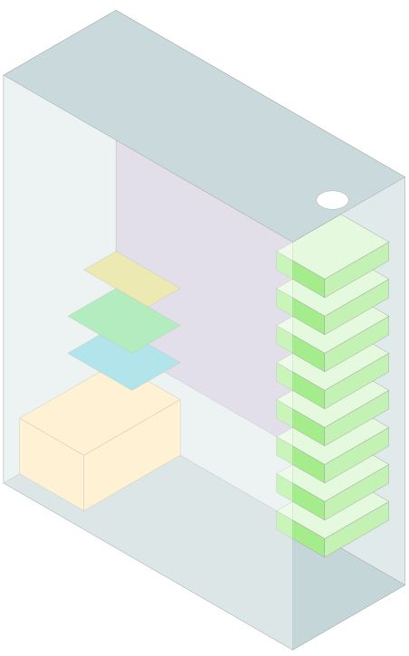

# Ubuntu 20.04 OpenZFS Home NAS
Scripts, links and build guide for an ATX case-based home NAS running Ubuntu and ZFS

## Scripts

* [ZFS Installer](https://github.com/saveriomiroddi/zfs-installer) - a script to run while installing Ubuntu, the inspiration for much of this project <3 
* Post-install Ubuntu cleanup script
* Post-install package install script
* [Share creation script](zfs_share_maker.sh)

## Parts

* Aquantia Aqtion 10gbe adapter(s)
* Marvell 9207-8i - New Old Stock (NOS)
* SFF-8087 to SATA Forward Breakout Cable
* 3+ matching SATA hard drives
* PCIe x1 M.2 NVMe card
* ATX motherboard 
* ATX case (Fractal Design R5 used)
* 2+ CAT6 cables (onboard plus NAS-specific cable(s)

## Maintenance

* Snapshot script
* Sync script
* `zc` guide
* What to alert on

## Docker on ZFS

* [Guide from Docker on ZFS Storage Driver](https://docs.docker.com/storage/storagedriver/zfs-driver/)

# Illustration of Sample System
Created in Inkscape, should be fully editable in Inkscape 1.0+

